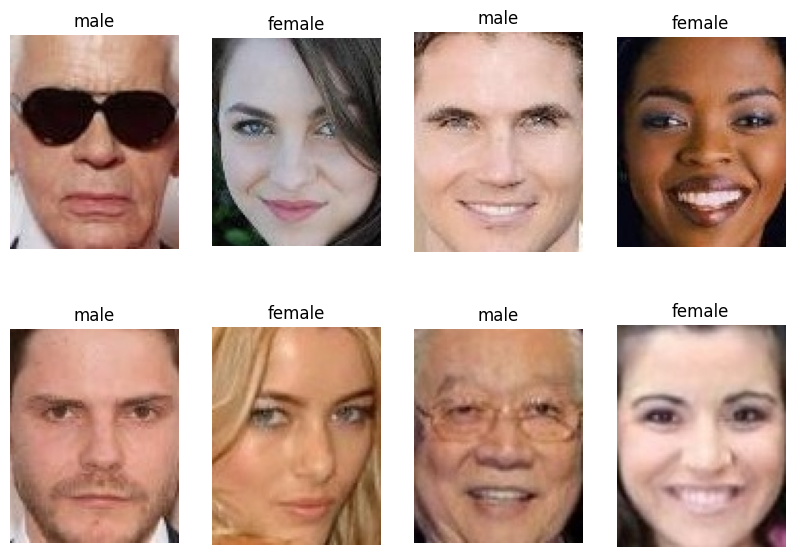
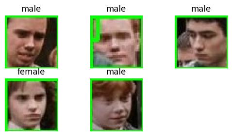

# GenderClassification
This project is aimed at building a CNN model to classify between two classes (male and female) given an image.
## Data
[Dataset on kaggle]([Model/TheFinalModelGenderClassification9680.h5](https://www.kaggle.com/datasets/cashutosh/gender-classification-dataset/))
- Training :47009

  
- Validation: 11649
  

  
  *Note : This set is splited to : 2,336 for testing and 9,313 for validation
- Samples:

 

## Training

### Augmentation
- RandomFlip("horizontal")
- RandomRotation(0.1)
- RandomZoom(0.1)
- RandomBrightness(factor=0.2)
- RandomContrast(factor=0.2)

### Callbacks
- LearningRateScheduler
- EarlyStopping (monitor='val_loss', patience=3)

### Model Architecture

### Compilation Parameters
- Adam : initial_lr = 0.0001, Drop = 0.1, Every 10 epochs
- loss : Categorical Cross Entropy
- metric : 'Accuracy'
- epochs : 19

### Training and Validation Matrices

- Tranining Acc : 0.0904
- Training loss : 0.9680
- Validation Acc : 0.0802
- Validation loss : 0.9695

## results
- Accuracy: 1.0
- Precision: 1.0
- Recall: 1.0
- F1-score: 1.0
- Confusion matrix:
  

## Links:
[Model File](Model/TheFinalModelGenderClassification9680.h5)
[Simple Flask Web App](App)
[Demo](https://drive.google.com/file/d/1zOo7D97CnysHc5TCuo03xhSi8YhYhey8/view?usp=sharing)
  
